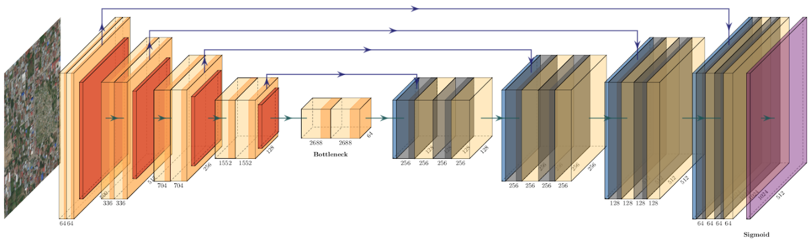
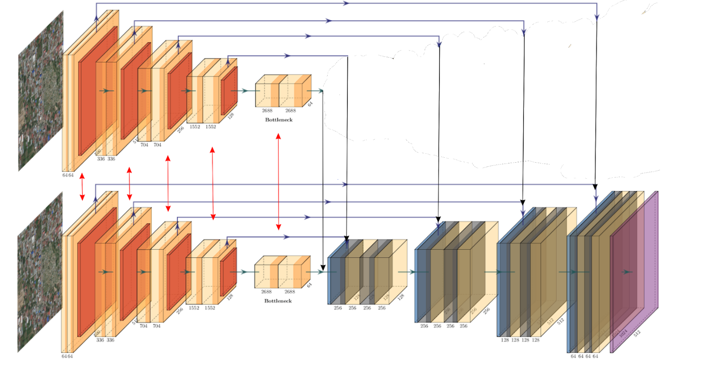

## Xview2 2nd place solution

### Data preparation

Download and extract dataset from https://xview2.org/dataset and put it to `data` directory (or whatever)
 
 #### Generate Masks
 
 Run `python generate_polygons.py --input data/train`
 This script will generate pixel masks from json files.
 
 ### Training
`Dockerfile` has all the required libraries.  
 
Most of the hyperparameters for training are defined by json files, see `configs` directory. 

Other parameters are passed directly to train scripts. 

Localization and classification networks are trained separately
* `train_localization.py` - to train binary segmentation models. By default O0 opt level (FP32) is used for Apex due to unstable loss during training.
* `train.py` - to train classification models. By default O1 opt level (Mixed-Precision) is used for Apex as multiclass loss `FocalLossWithDice` is stable in mixed precision .

### Architectures

For localization network ordinary U-Net like network was used with pretrained DPN92 and Densenet161 encoders (see `models/unet.py` for U-Nets Zoo)
 
 

For classification Siamese-UNet was used with shared encoder weights (see `models/siamese_unet.py` for Siamese U-Nets Zoo)

 
